# Entity-Relationship Diagram (ERD)

## PostgreSQL - IA_supply Database

## MongoDB Collections

```mermaid
erDiagram
    products ||--o{ inventory : stored
    warehouses ||--o{ inventory : contains
    warehouses ||--o{ shipments : origins
    warehouses ||--o{ shipments : destinations
    vehicles ||--o{ vehiclePositions : tracked
    aiModels ||--o{ aiPredictions : generates

    products {
        ObjectId _id PK
        string name
        string description
        string sku
        string category
        number price
        object attributes
        date createdAt
        date updatedAt
    }
    
    warehouses {
        ObjectId _id PK
        string name
        object location
        string address
        number capacity
        date createdAt
        date updatedAt
    }
    
    inventory {
        ObjectId _id PK
        ObjectId warehouseId FK
        ObjectId productId FK
        number quantity
        number reservedQuantity
        date createdAt
        date updatedAt
    }
    
    shipments {
        ObjectId _id PK
        string trackingNumber
        string status
        ObjectId originWarehouseId FK
        ObjectId destinationWarehouseId FK
        ObjectId vehicleId FK
        ObjectId driverId FK
        date estimatedDeparture
        date actualDeparture
        date estimatedArrival
        date actualArrival
        date createdAt
        date updatedAt
    }
    
    vehiclePositions {
        ObjectId _id PK
        ObjectId vehicleId FK
        number latitude
        number longitude
        date timestamp
    }
    
    aiModels {
        ObjectId _id PK
        string name
        string version
        string type
        string description
        string filePath
        number accuracy
        number trainingDataSize
        date createdAt
        date updatedAt
    }
    
    aiPredictions {
        ObjectId _id PK
        ObjectId modelId FK
        object inputData
        object prediction
        number confidence
        object actualResult
        date timestamp
    }
```

## Key Relationships

### Core Supply Chain Flow

1. **Suppliers** provide **Products**
2. **Products** are stored in **Warehouses** as **Inventory**
3. **Customers** place **Customer Orders**
4. **Customer Orders** are fulfilled through **Shipments**
5. **Shipments** use **Vehicles** and **Drivers**
6. **Vehicle Positions** track transportation in real-time

### Inventory Management

1. **Inventory Movements** track all stock changes
2. **Purchase Orders** replenish stock from suppliers
3. **Alerts** notify of low stock or other issues

### AI/ML Integration

1. **AI Models** generate **AI Predictions**
2. **Predictions** can be validated against actual results
3. **Models** are used for demand forecasting, route optimization, etc.

### User Management

1. **Users** create and manage all entities
2. **Users** resolve **Alerts**
3. **Users** have different roles (ADMIN, MANAGER, USER)

This comprehensive database design supports all aspects of supply chain management with proper relationships, constraints, and indexing for optimal performance.